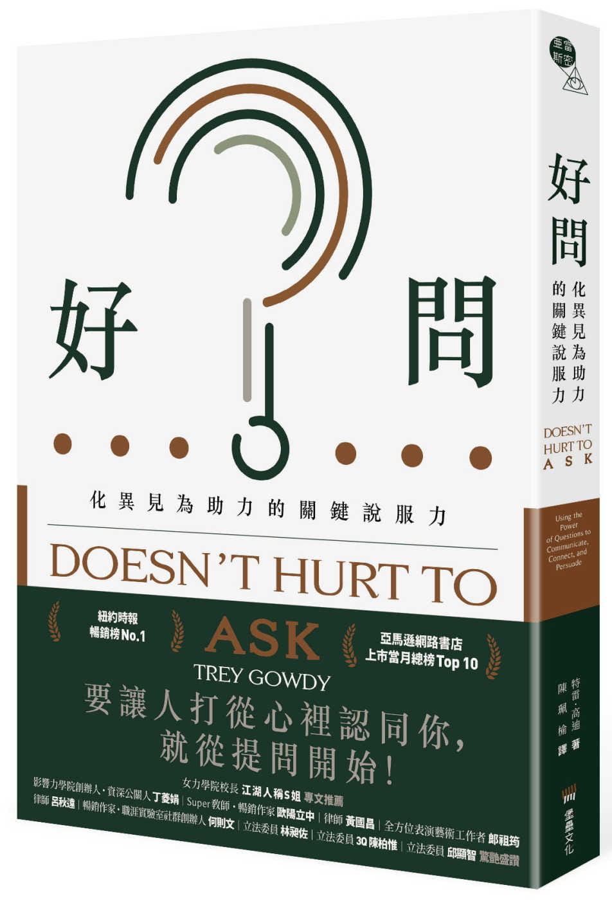

一名女子遭受毆打施暴之後，最後離開了她的丈夫。某天，在她的朋友載著她和兩個孩子的回程路上，從後照鏡看到一輛車不尋常的尾隨，那正是她的前夫，手上拿著一把手槍。

朋友很聰明，趕緊開車前往警察局，一路上連闖紅燈閃過車子，而她一邊打電話給 911，和警察描述她目前的處境以及前夫的罪狀。可惜差了一步，當她們在警察局後面的停車場停好車，警察也正要趕到現場時，她的前夫已經下了車，對車窗開了四槍。

她中彈身亡。兩個孩子躲在後座的地板上逃過一劫，但也失去了母親。她的前夫則被逮捕並被指控謀殺。

現在，你是一名檢察官，正在法庭之上。定罪階段已經結束 –– 無疑的，他犯了謀殺罪。而現在輪到你進行終結辯論，終結辯論結束之後，台下的十二名陪審團將會決定究竟該予以死刑，或無期徒刑。

你的目標是什麼？你會說什麼？你要怎麼說服台下的陪審團？

---

那名檢察官正是本書[《好問》](https://www.books.com.tw/products/0010891149)的作者 Trey Gowdy。

Trey Gowdy 當過美國的聯邦檢察官，也連任過四任國會議員。在這本書他說了很多關於說服成功或失敗的故事，這些故事說明說服的專家之所以能說服他人，並不只是因為口才好，而是花了很多心思了解事實、探問自己相信什麼、設定目標、準備質詢的問題、想像對方會有何回應，才能達成目的。他曾經為了一場十年未能定罪的兇殺案，花了一整年的時間研究案件照片、資料，思考開庭後如何發言、辯方可能的反擊，只為了替當事人討回公道。結果開庭當日，陪審團花了三十分鐘就裁定嫌犯有罪，並判處無期徒刑。真可謂台上半小時，台下一年功啊。

你會問：我們又不是檢察官，檢察官在法院上怎麼說服陪審團，和我有什麼關係？我們的確不是檢察官，但實際上，我們常常在說服他人：請你的孩子整理房間、勸說整天看電視像沙發馬鈴薯的長輩運動、讓同事理解你對工作成果的期待......無一不是說服，只是我們可能沒有察覺。說服，不是只有律師、外交官、商業談判才需要，而是我們每天都在做的事情。

而當我們說服他人的時候，Trey Gowdy 說，我們往往未曾想過目的是什麼，使得說服變成無效的爭辯。例如在臉書上常常可以看到立場不同的人在動態底下就政治問題(最近的話大概就是疫苗)討論起來。很快的，這些對話帶有越來越多的情緒和謾罵，往往沒能真的說服彼此，只是引來各自的支持者按讚或加入戰局，讓彼此更加對立。套作者說的，那不是說服，而是確認，確認誰是敵軍誰是友軍，但這並無助於讓立場相異的人理解不同的想法！許多時候我們以為我們想要說服對方，但我們實際想要的是贏得辯論，至於對方是否真的理解我們的想法，我們真的在乎嗎？

倘若我們真的在乎，又該怎麼做呢？Trey Gowdy 建議我們由詢問自己開始，事實是什麼？我相信什麼？目標是什麼？了解自己之後，又該去了解你的陪審團 –– 你要說服的人，他們相信什麼？如果你信媽祖，你的朋友是個基督徒，要說服他拜媽祖，可能比登天還難，而你也不該嘗試去做；但如果退而求其次，說服他尊重你拜媽祖的信仰，這倒是比較可能的目標。這只是個簡易的例子，但許多時候正是因為沒有事先了解你的陪審團，話說出口之後發現觸犯了對方的基本信念，就失去說服的機會了。

書裡除了這些基本的準備工作，也花了近半本書的篇幅在談提問與說服的行為和技術，例如怎麼質疑，何時該質疑對方的事實(氣候暖化不是事實，這是誰說的？)，或質疑對方的結論(租房子比較省錢，但這樣我就該租房子嗎？)，或甚至質疑對方本人。又或者如何透過重新包裝來突顯對方想法的荒謬，以「我聽到你說的是...(將對方的評論重新包裝)，但肯定你不是在說...(稍微誇張但指出問題)」的句子來指出對方邏輯薄弱之處。例如「媽，我聽到你說的是你希望我大學繼續住家裡，但肯定你不是在說我每天都該花三個小時通勤去學校？」。這些技巧我們可能聽說或親身體會過，但實在不像《好問》介紹得如此詳細，又充滿許多真實故事的例證。

寫到這裡，希望我已經成功說服你讀讀看這本書了！
